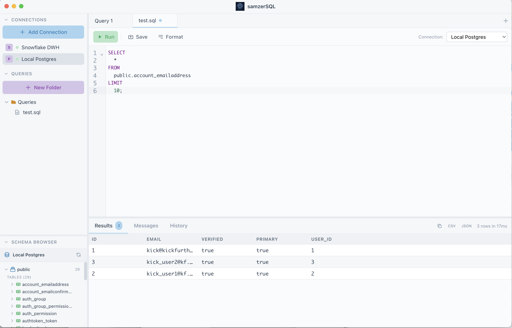

# samzerSQL

A cross-platform desktop SQL client for Snowflake, MySQL, and PostgreSQL with a clean, pastel-themed UI.



## Features

- **Multi-Database Support**: Connect to Snowflake, MySQL, and PostgreSQL databases
- **SQL Editor**: Full-featured editor with syntax highlighting powered by CodeMirror 6
- **Schema Browser**: Explore databases, schemas, tables, and columns with lazy loading
- **Auto-Complete**: Context-aware autocomplete for schemas, tables, and columns
  - In SELECT/WHERE clauses: suggests columns from tables in your FROM clause
  - In FROM clause: suggests schemas and tables
- **Query Management**: Organize queries in folders, save and load queries
- **Query History**: Track executed queries with execution time and row counts
- **Results Panel**: View query results in a virtualized table that handles large datasets
- **Export**: Export results to CSV or JSON
- **SQL Formatting**: Format your SQL with proper indentation and uppercase keywords

## Tech Stack

- **Electron** - Cross-platform desktop framework
- **React 18** - UI framework
- **TypeScript** - Type safety
- **Vite** - Fast bundling and HMR
- **Zustand** - Lightweight state management
- **CodeMirror 6** - SQL editor with syntax highlighting
- **Tailwind CSS** - Styling with custom pastel theme
- **sql-formatter** - SQL formatting

## Installation

```bash
# Install dependencies
npm install

# Run in development mode
npm run dev

# Build for production
npm run build

# Package as distributable
npm run package
```

## Keyboard Shortcuts

| Action | Mac | Windows/Linux |
|--------|-----|---------------|
| Run Query | `Cmd+Enter` | `Ctrl+Enter` |
| Save Query | `Cmd+S` | `Ctrl+S` |
| Format SQL | `Cmd+Shift+F` | `Ctrl+Shift+F` |
| Accept Autocomplete | `Tab` | `Tab` |

## Usage

### Connecting to a Database

1. Click **Add Connection** in the sidebar
2. Select your database type (Snowflake, MySQL, or PostgreSQL)
3. Enter connection details
4. Click **Test Connection** to verify
5. Click **Save** to add the connection

### Writing Queries

1. Click on a connection to connect
2. Write your SQL in the editor
3. Press `Cmd/Ctrl+Enter` or click **Run** to execute
4. View results in the bottom panel

### Auto-Complete

- Type a schema name and press `.` to see tables
- Type a table name and press `.` to see columns (in SELECT/WHERE)
- Press `Tab` to accept the first suggestion
- Press `Ctrl+Space` to manually trigger autocomplete

### Organizing Queries

- Right-click in the **Queries** section to create folders
- Right-click on a folder to create new queries
- Double-click to rename queries or folders
- Drag to reorder (coming soon)

## Project Structure

```
src/
├── main/                 # Electron main process
│   ├── database/         # Database adapters
│   │   ├── postgres.ts
│   │   ├── mysql.ts
│   │   └── snowflake.ts
│   ├── storage/          # Local storage for queries
│   └── index.ts          # Main entry point
├── renderer/             # React frontend
│   ├── components/       # UI components
│   ├── stores/           # Zustand stores
│   └── assets/           # Images and icons
└── shared/               # Shared types
```

## Building

```bash
# Build for current platform
npm run package
```

Output will be in the `release/` folder:
- **macOS**: `.dmg` installer and `.app` bundle
- **Windows**: `.exe` installer
- **Linux**: `.AppImage`

## License

MIT

## Author

Samir Madhavan
